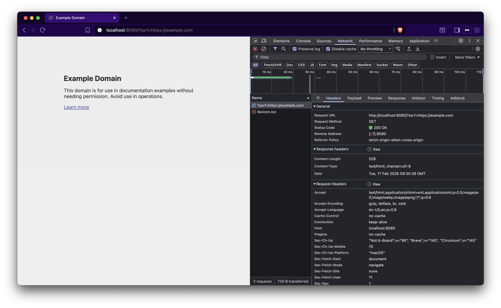

Take a close look at [ssrf.go](ssrf.go). There’s a very simple code snippet that does the following:

1. Accepts a URL from the user via the `?ssrf` parameter.
2. Fetches that URL server-side.
3. Renders the fetched response.

Yes, a classic [Server-Side Request Forgery (SSRF)](https://portswigger.net/web-security/ssrf) scenario.

> User’s browser (`example.com`) → Server fetches (`example.com`) → Server returns the fetched response back to the user’s browser.

This allows an attacker to access internal resources, for example:

* Amazon Web Services → `http://169.254.169.254/latest/meta-data/`
* Google Cloud → `http://169.254.169.254/computeMetadata/v1/`
* Microsoft Azure → `http://169.254.169.254/metadata/instance?api-version=...`

Next, we’ll examine the different approaches developers use to fix this issue, why a solution that works in one scenario may fail in another, the common mistakes they make, and how attackers manage to bypass those fixes.

Go to [Case II](/SSRF/Case%20II/)
