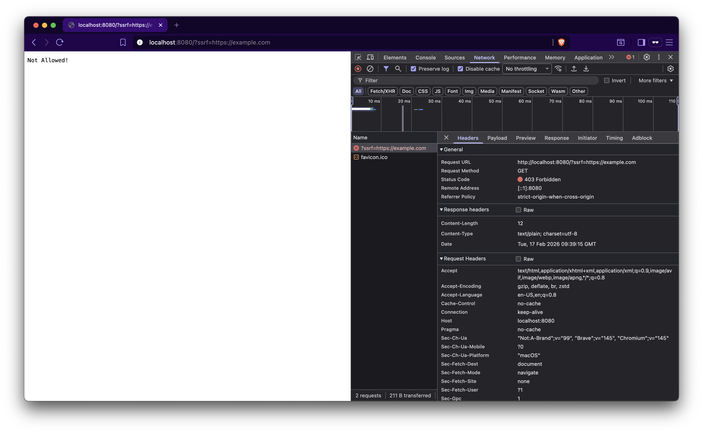

### Question:

This time in [ssrf.go](ssrf.go), something new is added:

```
strings.Contains(ssrf, "vercel.app")
```

We're explicitly checking whether the user-supplied URL contains the substring `vercel.app`, and this does make sure that an attacker can't use `?ssrf=http://example.com` or `ssrf=https://<internal-ip>` or hit our internal endpoints, since the URL doesn’t contain `vercel.app`.



So, the question is:

> Is it still possible to bypass & fetch `example.com`?
> If yes, how?

* Need help or want to verify your answer? Go to [Solution](/SSRF/Case%20II/solution.md)
* Already found the bypass? Go to [Case III](/SSRF/Case%20III/)