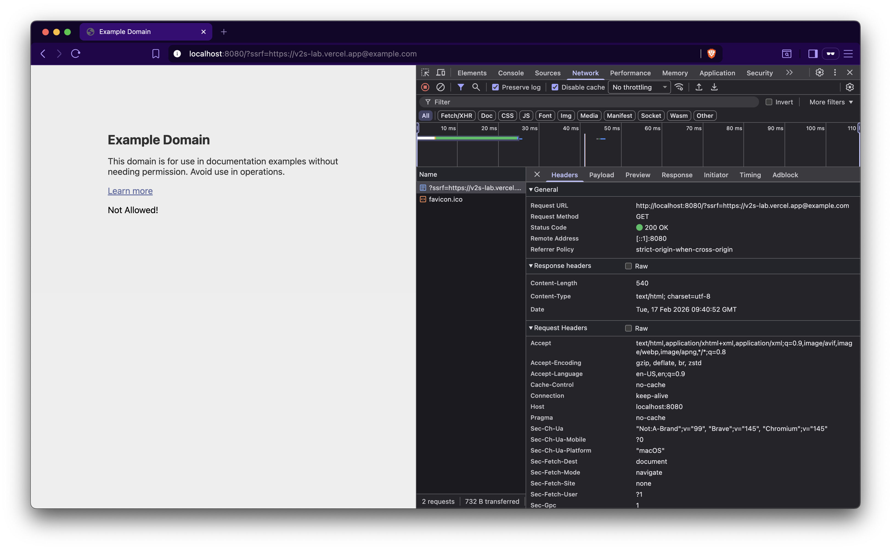

This time in [ssrf.go](ssrf.go), we're using `strings.Contains(ssrf, "vercel.app")`, which checks whether the user-supplied URL contains `vercel.app`.

This does make sure that an attacker can't simply use `?ssrf=http://example.com` or `ssrf=https://<internal-ip>`, since the URL doesn’t contain `vercel.app`.

But does it really fix the issue?

It only checks whether the input string contains the substring `vercel.app` anywhere. It does not check the actual hostname. Because of that, an attacker can bypass this in multiple ways:

* `https://x.vercel.app@example.com` (typical open-redirect style bypass)
* `https://x.vercel.app.example.com` (subdomain-based bypass)
and many more ways.

This ensures the supplied URL contains the substring `vercel.app`, but the URL is not actually pointing to `vercel.app`. Instead, it is pointing to a third-party domain or internal ip (for further exploitation).

