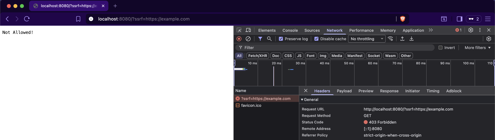
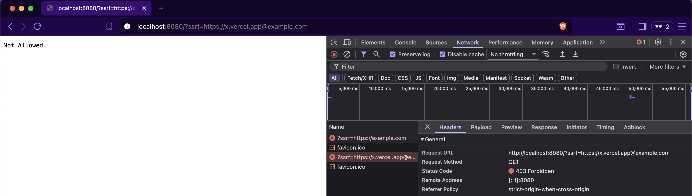
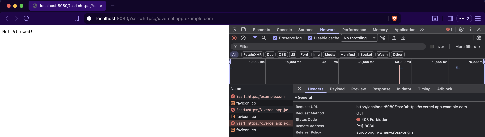

### Question:

This time in [ssrf.go](ssrf.go), the case is a bit different. We are now parsing the URL, extracting the hostname, and then comparing it to a specific value (e.g., `vercel.app`). This simply means `https://x.vercel.app@example.com` or `https://x.vercel.app.example.com` will no longer work as a bypass, because the hostname of neither of these domains is `vercel.app`, so they will fail the `if` condition.

So, the question is: 
> is it still possible to bypass & fetch `example.com`? 
> If yes, how?

* Need help or want to verify your answer? Go to [Solution](/SSRF/Case%20III/solution.md)
* Already found the bypass? Go to [Case IV](/SSRF/Case%20IV/)