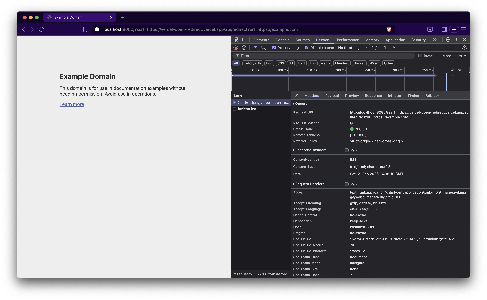

This time, [ssrf.go](ssrf.go) explicitly checks the hostname. So, if we directly use `https://x.vercel.app@example.com` or `https://x.vercel.app.example.com`, it will fail since it does not match the expected hostname `*.vercel.app`. This may look like a perfect fix, but it actually is not.



**Payload:**
```
http://localhost:8080/?ssrf=https://vercel-open-redirect.vercel.app/api/redirect?url=https://example.com
```
> The `url` parameter on `vercel-open-redirect.vercel.app` performs a 302 redirection. 

In this case:
* The hostname extracted is `vercel-open-redirect.vercel.app`
* The hostname check passes
* The request proceeds
* The second `302` redirect to `https://example.com` is never evaluated by the hostname validation. 

Server fetches (`example.com` or internal IPs) → Server returns the fetched response back to attacker. Hence, bypassed! 

* Ready for the next one? Go to [Case IV](/SSRF/Case%20IV/)