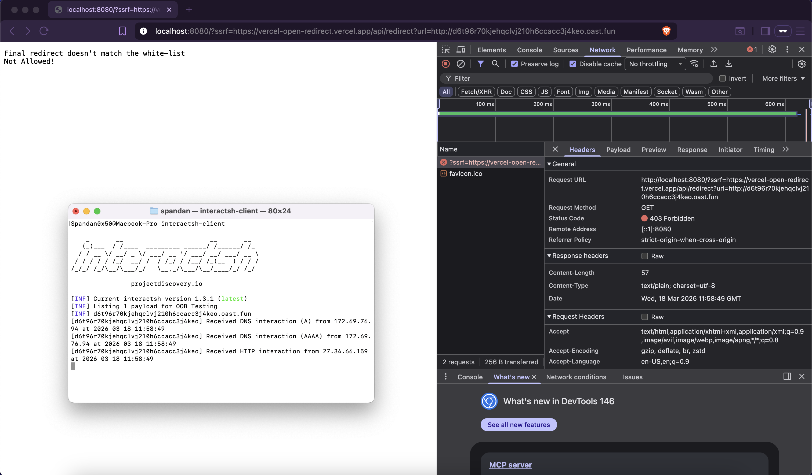
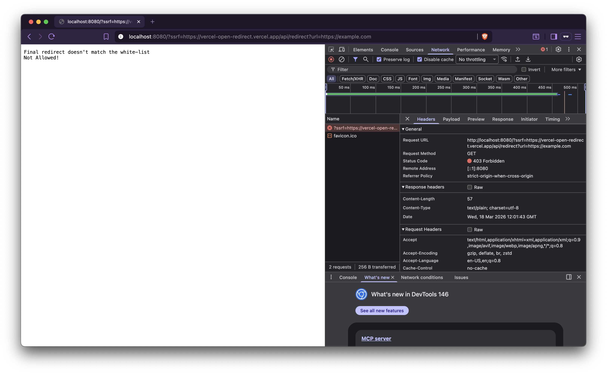

### Issue 1:

Yes, there is a validation check in place. However, due to the use of `resp, err := http.Get(ssrf)`, a blind SSRF still occurs.

> Even though an error is returned, the server still makes the request to the provided URL. This can be further leveraged for scenarios such as internal port scanning or interacting with internal services (depending on the environment).

---

### Issue 2:

A **DNS rebinding** scenario can be used to bypass the validation entirely.

1. In real-world scenarios, servers often block access to internal or sensitive IP ranges and only allow external domains.
2. An attacker can register a domain and configure its A/AAAA records to resolve to an internal IP address.
   

   > Alternatively, services like [nip.io](https://nip.io/) can be used.
3. In this case, all hostname-based checks pass successfully. However, after validation, the allowed domain resolves to an internal IP via its A/AAAA record, resulting in SSRF.
